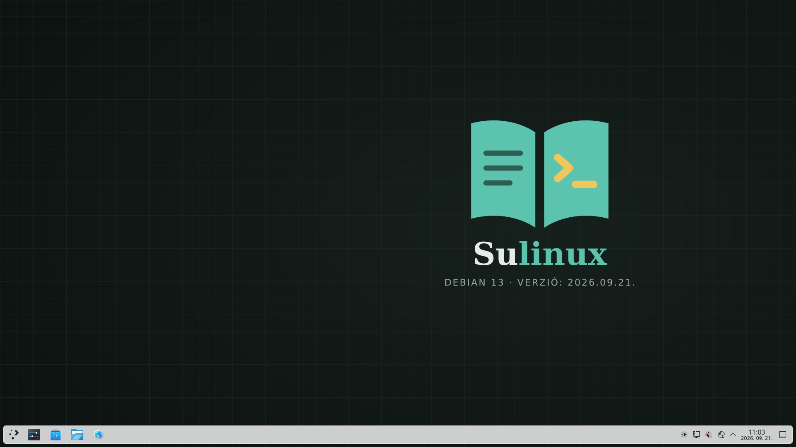

<p align="center">
  
</p>

<h1 align="center">Sulinux</h1>

<p align="center">
  Magyar nyelvű, Debian 13 alapú oktatási Linux KDE Plasma felülettel.<br>
  Benne van a digitális kultúra érettségi Linuxon elérhető programjainak nagy része;
  a többi egy paranccsal telepíthető.<br>
  Iskolai és otthoni PC-kre, laptopokra egyaránt telepíthető.
</p>

<p align="center">
  
</p>

<p align="center">
  <a href="https://e.pcloud.link/publink/show?code=XZB40k7ZaTKwKJg8Rq8S7KQmVRCb08Jc5yWX"><strong>Letöltés: sulinux-13-amd64.hybrid.iso</strong></a> (3,3 GB)
</p>

---

## Tartalom

Bevezetés
- [Letöltés](#letöltés)
- [Mi van benne?](#mi-van-benne)
- [Kipróbálás és telepítés](#kipróbálás-és-telepítés)
- [Rendszerkövetelmény](#rendszerkövetelmény)
- [Az asztal használata](#az-asztal-használata)
- [Honnan tudom, hogy Sulinux?](#honnan-tudom-hogy-sulinux-van-a-gépen)

Érettségi
- [Microsoft Office-dokumentumok](#microsoft-office-dokumentumok)
- [Adatbázis-feladatok (phpMyAdmin)](#adatbázis-feladatok-phpmyadmin)

Egyéb
- [Médiaprogramok](#médiaprogramok)
- [Hibaelhárítás](#hibaelhárítás)

Rendszergazdáknak
- [Programok telepítése](#programok-telepítése)
- [Egész terem telepítése](#egész-terem-telepítése)
- [Rendszermentés és visszaállítás](#rendszermentés-és-visszaállítás)
- [Az ISO építése](#az-iso-építése)
- [Pendrive készítése](#pendrive-készítése)
- [Fájlrendszer: Btrfs](#fájlrendszer-btrfs)
- [A háttérkép](#a-háttérkép)

---

# Bevezetés

## Letöltés

Az ISO-fájl (3,3 GB): **[sulinux-13-amd64.hybrid.iso](https://e.pcloud.link/publink/show?code=XZB40k7ZaTKwKJg8Rq8S7KQmVRCb08Jc5yWX)**

SHA-256 ellenőrzőösszeg ([sulinux-13-amd64.hybrid.iso.sha256](https://e.pcloud.link/publink/show?code=XZEL0k7Zl71GFOwa7s8nLS3Pa3N5dkbvIjfk)):

```
b548e6936e71e27c6eca0d541c3be6339b4e0e9b4395b2ceea4451f9853860a3
```

A letöltött fájl ellenőrzése (a kiírt értéknek egyeznie kell a fentivel):

- Linux, macOS: `sha256sum sulinux-13-amd64.hybrid.iso`
- Windows (PowerShell): `Get-FileHash sulinux-13-amd64.hybrid.iso`

## Mi van benne?

| Terület | Programok |
|---|---|
| Irodai | LibreOffice (Writer, Calc, Impress, Base) magyar helyesírással |
| Adatbázis | MariaDB + phpMyAdmin (az XAMPP-hoz hasonlóan: root, jelszó nélkül, csak helyben) |
| Grafika | GIMP, Inkscape |
| Programozás | Python + IDLE, Thonny, Code::Blocks (C/C++), OpenJDK (Java), Geany, Kate, Zeal |
| Média | OpenShot, Audacity, VLC |
| Kiegészítők\*: `base` | VS Code (Python, Pylance, Live Server, C#), .NET SDK, PyCharm, Microsoft-fontok |
| Kiegészítők\*: `java` | IntelliJ IDEA, NetBeans |

\* Ezek nincsenek a telepítőben: a `base` csoport licence nem engedi a továbbterjesztést, a
többi pedig nagy, és nem minden gépre kell. Telepítés után egy paranccsal tölthetők le – lásd
[Kiegészítők telepítése](#kiegészítők).

## Kipróbálás és telepítés

A Sulinux pendrive-ról telepítés nélkül is elindítható: így kipróbálhatod, működik-e a
Wi-Fi, a hang és a kijelző, mielőtt bármit módosítanál a gépen.

1. Pendrive készítése. [Töltsd le](#letöltés), majd írd az ISO-fájlt egy legalább 8 GB-os pendrive-ra a
   *balenaEtcher* programmal (Windows, macOS, Linux), lásd:
   [Pendrive készítése](#pendrive-készítése). A pendrive-on lévő adatok törlődnek.
2. Indítás a pendrive-ról. Dugd be a pendrive-ot, kapcsold be a gépet, és rögtön nyomogasd a
   rendszerindító menü gombját. Ez gyártótól függ: általában <kbd>F12</kbd> (Dell, Lenovo, Acer),
   <kbd>F9</kbd> (HP), <kbd>F8</kbd> vagy <kbd>Esc</kbd> (Asus), <kbd>F11</kbd> (MSI). A listából
   válaszd a pendrive-ot.
3. Élő rendszer. A megjelenő menüben válaszd az első sort (*Live system*). Pár perc múlva betölt a magyar
   nyelvű asztal. Az élő rendszer felhasználója `diak`, a jelszava `live`. Itt minden
   kipróbálható, de a változások újraindításkor elvesznek.
4. Telepítés. Az asztalon vagy a menüben indítsd el a *Sulinux telepítése* programot.
   Válaszd ki a nyelvet, az időzónát és a billentyűzetet (ezek már magyarra vannak állítva),
   majd a lemezt.
5. Lemez kiválasztása. *Lemez törlése*: az egész gépen csak Sulinux lesz. A rendszerindító
   menü a Debian nevét mutatja – ez így van rendjén, a Sulinux Debianra épül. *Telepítés
   mellé*: a Windows megmarad, és induláskor választhatsz. Bizonytalan esetben előbb ments le
   minden fontos fájlt. A fájlrendszer alapból Btrfs: tömörít, így kevesebb helyet foglal,
   és [rendszermentés](#rendszermentés-és-visszaállítás) készíthető róla. Ezt nem kell átállítanod.
6. Felhasználó létrehozása. Add meg a neved, a felhasználóneved és egy jelszót. Ezt a
   jelszót kéri a rendszer programok telepítésekor és beállítások módosításakor is, ezért
   jegyezd meg.
7. Újraindítás. A telepítés végén indítsd újra a gépet, és húzd ki a pendrive-ot, amikor a
   program kéri.
8. Kiegészítők telepítése – ne felejtsd ki! Az első bejelentkezés után csatlakozz az
   internetre, nyisd meg a parancssort (<kbd>Ctrl</kbd> + <kbd>Alt</kbd> + <kbd>T</kbd>), és futtasd:
   ```sh
   sudo sulinux-addons
   ```
   Ez tölti le a VS Code-ot, a PyCharmot, a Java-fejlesztőkörnyezeteket és a Microsoft-fontokat,
   amelyek nincsenek benne a telepítőben. Ha csak néhány csoport kell, azt is megadhatod.
   Részletek: [Kiegészítők](#kiegészítők).

## Rendszerkövetelmény

| | |
|---|---|
| Processzor | 64 bites Intel vagy AMD, legalább 2 mag |
| Memória | 4 GB RAM |
| Tárhely | 40 GB, SSD-vel sokkal gyorsabb |
| Rendszerindítás | UEFI (Secure Boot bekapcsolva is) vagy hagyományos BIOS |

32 bites (nagyon régi) processzorokon nem fut. Ha nem tudod, milyen a géped: ha 2012 után
vásárolták, szinte biztosan megfelel.

## Az asztal használata

A KDE Plasma felület a Windowshoz hasonló: bal alul a menü, alul a tálca, jobb alul az óra, a
hálózat és a hangerő.

| Billentyű | Mit csinál |
|---|---|
| <kbd>Windows</kbd> | Menü megnyitása; utána gépelj, és megkeresi a programot |
| <kbd>Windows</kbd> + <kbd>E</kbd> | Fájlkezelő (Dolphin) |
| <kbd>Ctrl</kbd> + <kbd>Alt</kbd> + <kbd>T</kbd> | Parancssor (Konsole) |
| <kbd>Print Screen</kbd> | Képernyőkép (Spectacle) |
| <kbd>Windows</kbd> + <kbd>L</kbd> | Képernyő zárolása |
| <kbd>Alt</kbd> + <kbd>Tab</kbd> | Váltás az ablakok között |

A Rendszerbeállítások programban állítható a háttérkép, a kijelző, a nyomtató és a
hálózat. A pendrive-ok és telefonok automatikusan megjelennek a fájlkezelőben.

Ez a leírás a telepített rendszerből is megnyitható: menü → Sulinux súgó (internet kell hozzá).

## Honnan tudom, hogy Sulinux van a gépen?

A Sulinux egy előre beállított Debian: a telepítőn kívül a rendszer neve, a rendszerindító
menü és a bejelentkezőképernyő a Debian eredeti kinézetét mutatja. Hogy Sulinuxot
használsz, parancssorból tudhatod meg:

```sh
cat /etc/sulinux-release
```

Ez kiírja a nevet, a Debian-verziót és az építés dátumát.

---

# Érettségi

## Microsoft Office-dokumentumok

A LibreOffice megnyitja és menti a `.docx`, `.xlsx` és `.pptx` fájlokat. Mentéskor válaszd a
*Mentés másként* lehetőséget és a *Word 2007–365* formátumot, ha a fájlt Windowson is
megnyitják. A Calibri és a Cambria helyett méretazonos fontok (Carlito, Caladea) vannak
telepítve, így a tördelés nem csúszik szét. Az Arial és a Times New Roman a
[kiegészítőkkel](#kiegészítők) kerül fel.

## Adatbázis-feladatok (phpMyAdmin)

Az adatbázis-szerver takarékosságból nem indul el magától a gép bekapcsolásakor. Így kell
használni:

1. A menüben indítsd el a phpMyAdmin programot. A rendszer kéri a jelszavadat, majd
   elindítja a szervert, és megnyitja a böngészőben a `http://localhost/phpmyadmin` oldalt.
2. Belépés: felhasználó `root`, a jelszó mezőt hagyd üresen – ugyanúgy, mint az érettségin
   használt XAMPP-ban.
3. Adatok importálása: bal oldalt hozz létre egy új adatbázist, majd az *Importálás* fülön
   töltsd fel a feladat `.sql` vagy `.txt` fájlját. Magyar ékezetekhez válaszd az
   `utf8mb4_hungarian_ci` illesztést.
4. Ha végeztél, a menüben futtasd az Adatbázis-szerver leállítása programot, vagy
   egyszerűen kapcsold ki a gépet.

A szerver csak a saját gépről érhető el, a hálózat felől nem, így a jelszó nélküli belépés
nem jelent veszélyt.

---

# Egyéb

## Médiaprogramok

| Program | Mire való |
|---|---|
| OpenShot | Videószerkesztés: vágás, feliratok, átmenetek, zene |
| Audacity | Hangfelvétel és hangvágás, zajszűrés, podcast |
| VLC | Videó- és zenelejátszás |

## Hibaelhárítás

<details>
<summary>A gép nem indul el a pendrive-ról</summary>

Próbáld a gép másik USB-portjával (lehetőleg közvetlenül a gépen, nem elosztón). A BIOS/UEFI
beállításokban (általában <kbd>F2</kbd> vagy <kbd>Del</kbd> indításkor) ellenőrizd, hogy az
USB-ről indítás engedélyezve van-e. Ha van *Fast Boot* beállítás, kapcsold ki. Írd újra a
pendrive-ot, és ellenőrizd az ISO-fájl ellenőrzőösszegét.
</details>

<details>
<summary>Fekete képernyő vagy torz kép indításkor</summary>

Az indítómenüben válaszd a *fail-safe mode* (biztonságos mód) sort. NVIDIA-kártyás gépeken
telepítés után a *Discover*-ben vagy a `sudo apt install nvidia-driver` paranccsal
telepíthető a gyártói meghajtó.
</details>

<details>
<summary>Nincs Wi-Fi</summary>

Kattints jobb alul a hálózat ikonjára, és nézd meg, látszanak-e hálózatok. Laptopon
ellenőrizd, nincs-e repülőgép-üzemmódban (gyakran <kbd>Fn</kbd> + egy F-gomb). Ha egyáltalán
nincs Wi-Fi-eszköz, csatlakozz kábellel, frissítsd a rendszert, majd indítsd újra.
</details>

<details>
<summary>Nincs hang</summary>

Kattints jobb alul a hangszóró ikonra, és ellenőrizd, jó kimenet (hangszóró, fejhallgató,
HDMI) van-e kiválasztva, és nincs-e lenémítva.
</details>

<details>
<summary>A nyomtató nem működik</summary>

Rendszerbeállítások → *Nyomtatók* → *Nyomtató hozzáadása*. A legtöbb USB- és hálózati
nyomtatót magától felismeri; HP nyomtatóknál a `hp-setup` parancs is segít.
</details>

<details>
<summary>Elfelejtettem a jelszavam</summary>

Ha a gépen van másik rendszergazda-felhasználó, ő a Rendszerbeállítások → *Felhasználók*
menüben új jelszót adhat. Egyébként kérd a rendszergazda segítségét.
</details>

<details>
<summary>A phpMyAdmin nem nyílik meg</summary>

Indítsd el újra az Adatbázis-szerver indítása programot, és várj pár másodpercet.
Parancssorban így ellenőrizheted, fut-e: `sulinux-database status` – mindkét sornak
`active`-nak kell lennie.
</details>

---

# Rendszergazdáknak

## Programok telepítése

Az ISO egyféle, minden gépre ugyanaz. Minden további program a már telepített gépre kerül fel,
rendszergazdai jelszóval.

### Kiegészítők

Néhány program nincs benne a Sulinux telepítőjében: vagy a licence nem engedi a
továbbterjesztést, vagy nagy, és nem minden gépre kell. Ezeket telepítés után, a
rendszergazda tölti le – csak akkor kerülnek a gépre, ha kiadja a parancsot:

```sh
sudo sulinux-addons                      # minden csoport
sudo sulinux-addons base java            # csak a megadott csoportok
```

Nyisd meg a parancssort (<kbd>Ctrl</kbd> + <kbd>Alt</kbd> + <kbd>T</kbd>), írd be a fenti
parancsot, és add meg a jelszavadat. Grafikusan is indítható (minden csoportot telepít): menü →
Kiegészítők telepítése.

| Csoport | Program | Mire kell | Miért nincs a telepítőben |
|---|---|---|---|
| `base` | Visual Studio Code | Weblap, Python, C# (érettségi) | A Microsoft licence nem engedi a továbbterjesztést |
| `base` | VS Code-bővítmények | Python, Pylance, Live Server, C#, C# Dev Kit | A Pylance és a C# Dev Kit zárt licencű |
| `base` | .NET SDK | C# programozás | Csak a Microsoft tárolójából érhető el |
| `base` | PyCharm | Python (érettségi) | A korábbi, szabad Community kiadás megszűnt; az utódja zárt licencű |
| `base` | Microsoft-fontok | Arial, Times New Roman, Verdana stb. a Word-dokumentumokhoz | A Microsoft licence nem engedi a továbbterjesztést |
| `java` | IntelliJ IDEA, NetBeans | Java (érettségi) | Együtt kb. 9 GB-ot foglalnak (Flathub) |

A parancs a gép minden felhasználójának beállítja a VS Code-bővítményeket, a később
létrehozott felhasználóknak is. Nyugodtan futtatható többször: ha valami megszakadt,
egyszerűen indítsd újra. Frissítéseket ezek a programok is a szokásos rendszerfrissítéssel
kapnak.

### Más programok

- Discover (grafikusan): a menüben indítsd el a Discover programot, keresd meg a program
  nevét, majd kattints a *Telepítés* gombra. A Discover a Debian programjait és a
  [Flathub](https://flathub.org) alkalmazásait is mutatja.
- Parancssorból:
  ```sh
  sudo apt update
  sudo apt install programnév              # Debian-program, pl. kdenlive
  flatpak install flathub azonosító        # Flathub-alkalmazás, pl. org.gnome.Maps
  ```

## Egész terem telepítése

Egy teremnyi gépet nem kell egyenként telepíteni, és a kiegészítőket sem kell minden gépen
külön letölteni. Elég egyetlen gépet elkészíteni, majd a lemezét a többire átmásolni
(klónozni):

1. Telepítsd a Sulinuxot egy gépre (ez lesz a mintagép).
2. Telepítsd rá a szükséges [kiegészítőket](#kiegészítők) és programokat, és állíts be
   mindent, amit minden gépen látni szeretnél (felhasználók, nyomtató, háttérkép).
3. Indítsd a mintagépet [Clonezilla](https://clonezilla.org) pendrive-ról, és ments róla
   lemezképet (*device-image*) egy külső lemezre vagy hálózati tárhelyre.
4. Töltsd rá a lemezképet a többi gépre. A Clonezilla Server Edition (vagy a DRBL) multicast
   módban, hálózati indítással (PXE) egyszerre az egész termet elkészíti: 20–30 gép nagyjából
   fél óra alatt.

A klónozás hasonló hardverű gépeknél működik a legjobban. Eltérő gépeknél (pl. otthoni
laptopok) a pendrive-os telepítést használd.

## Rendszermentés és visszaállítás

A Sulinux a rendszer állapotát el tudja menteni, és egy elállított vagy elrontott gép pár
perc alatt visszaállítható egy korábbi mentésre. A mentés a programokat és a
beállításokat tartalmazza. A felhasználók saját fájljait (*Dokumentumok*, *Képek*, *Asztal*
stb.) nem menti, és a visszaállítás sem módosítja őket.

### Mikor készül mentés?

| Mentés | Mikor | Meddig marad meg |
|---|---|---|
| Telepítés utáni állapot | Magától, a telepített gép első indulásakor | Mindig, a rendszer soha nem törli |
| Kézi mentés | Amikor elindítod | A legutóbbi 10 marad meg, a régebbieket a rendszer törli |

Más, automatikus mentés nincs, így a mentések nem foglalják feleslegesen a lemezt.

### Kézi mentés készítése

1. A menüben indítsd el a Rendszermentés készítése programot.
2. Adj nevet a mentésnek, amiből később tudni fogod, mi volt akkor a gépen (pl. *Tanév
   eleje*, *Nyomtató beállítva*, *Érettségi előtt*).
3. Add meg a rendszergazdai jelszót. Pár másodperc múlva értesítés jelzi, hogy a mentés
   elkészült.

Parancssorból is elindítható, például egy terem összes gépén távolról:

```sh
sudo sulinux-snapshot "Tanév eleje"
```

### A mentések megtekintése

A Btrfs Assistant program *Snapper* fülén, vagy parancssorból:

```sh
sudo snapper list
```

### Visszaállítás

1. Indítsd el a Btrfs Assistant programot (rendszergazdai jelszót kér), és válaszd a
   *Snapper* fület.
2. A listából válaszd ki a kívánt mentést (a leírás és a dátum alapján), majd kattints a
   *Restore* (visszaállítás) gombra, és erősítsd meg.
3. Indítsd újra a gépet. A rendszer a mentés állapotában indul el. A visszaállítás előtti
   állapotról a program maga is ment egy példányt, így ha tévedtél, az is visszaállítható.

### Régi mentések törlése

A kézi mentésekből a rendszer a legutóbbi 10-et tartja meg, és akkor is törli a
legrégebbieket, ha fogy a hely. Kézzel a Btrfs Assistant-ban, a mentést kijelölve a
*Delete* gombbal törölhetsz, vagy parancssorból (a számot a `snapper list` mutatja):

```sh
sudo snapper delete 5
```

> [!WARNING]
> A rendszermentés ugyanazon a lemezen van, mint maga a rendszer. Szoftveres hibák és
> elállítások ellen véd, de ha a lemez tönkremegy, a mentés is elvész.

A rendszermentés csak akkor működik, ha a gépet az alapértelmezett Btrfs fájlrendszerrel
telepítették. Ext4 vagy XFS esetén a program jelzi, hogy nem érhető el.

## Az ISO építése

Az ISO-fájl bármilyen gépen – Windowson, macOS-en és Linuxon is – egyetlen paranccsal
megépíthető. Csak a Docker kell hozzá:

- Windows, macOS: telepítsd a [Docker Desktopot](https://docs.docker.com/get-docker/), és
  indítsd el.
- Linux: `sudo apt install docker.io` (vagy a disztribúciód Docker-csomagja).

Az építéshez kb. 25 GB szabad hely, az első alkalommal kb. 3 GB letöltés és 30–90 perc kell.

### Építés

1. Nyiss parancssort (Windowson: *PowerShell*), és lépj abba a mappába, ahová az ISO-t kéred.
2. Másold be és futtasd ezt a parancsot:
   ```sh
   docker run --rm --privileged --platform linux/amd64 -v sulinux-build:/build -v "${PWD}:/host" debian:trixie bash -c "apt-get update -qq && apt-get install -y -qq curl >/dev/null && curl -fsSL https://raw.githubusercontent.com/laszlorepassy/sulinux/main/build.sh | bash"
   ```
   Linuxon, ha a Dockerhez rendszergazdai jog kell, írd elé: `sudo`.
3. Kész. Az ISO az adott mappa `out/` almappájába kerül, mellette a `.sha256`
   ellenőrzőösszeg és az építés naplója (`build.log`). A végén a parancs azt is kiírja,
   hogyan írd [pendrive-ra](#pendrive-készítése).

A parancs a GitHubon lévő legfrissebb Sulinuxot építi. Ha a projekt letöltött (és akár
módosított) mappájában futtatod, az ott lévő változatot.

Újraépítéskor ugyanez a parancs; a már letöltött csomagokat nem tölti le újra. A tárolt
csomagok törlése (hely felszabadítása vagy tiszta újrakezdés):

```sh
docker volume rm sulinux-build
```

## Pendrive készítése

Az ISO kb. 3,3 GB. A pendrive-on lévő összes adat törlődik.

A kiíráshoz a balenaEtchert használd: Windowson, macOS-en és Linuxon is ugyanígy működik.

1. Töltsd le és indítsd el: <https://etcher.balena.io/>
2. *Flash from file* → válaszd ki az ISO-fájlt.
3. *Select target* → válaszd ki a pendrive-ot.
4. *Flash!* – a végén magától ellenőrzi az írást. Ezután a pendrive kihúzható.

A pendrive-ról indítás és a telepítés lépései: [Kipróbálás és telepítés](#kipróbálás-és-telepítés).

## Fájlrendszer: Btrfs

A telepítő Btrfs-t használ (`/etc/calamares/modules/partition.conf`, `mount.conf`):
zstd-tömörítés, alkötetek (`@`, `@home`, `@cache`, `@log`), swap-partíció helyett zram. Ext4 és
XFS a telepítőben továbbra is választható.

A telepített gép első indulásakor az `sulinux-snapshot-setup` szolgáltatás
beállítja a snappert (automatikus mentés nélkül), és elkészíti a „Telepítés utáni állapot”
mentést. A kézi mentést az `sulinux-snapshot` szkript készíti – lásd
[Rendszermentés és visszaállítás](#rendszermentés-és-visszaállítás).

## A háttérkép

A rendszer Debian marad a saját nevével és kinézetével; a Sulinuxot az
`/etc/sulinux-release` fájl jelzi. A háttérkép a könyves logót, a
*Sulinux* feliratot és az építés dátumát (verziót) mutatja.
